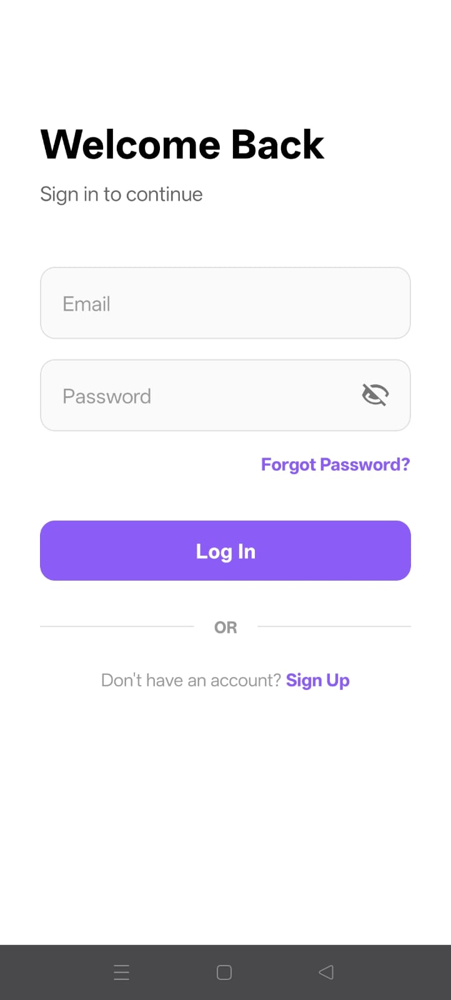

<div id="top"></div>

<!-- PROJECT LOGO -->
<br />
<div align="center">
  <a href="https://github.com/Gauravch-dev/EventLink">
    
  </a>

<h3 align="center">EventLink</h3>
<p align="center">
  
  
  
  
  
  
  
  
</p>


  <p align="center">
    Connect, Create, and Discover Tech Events with AI-Powered Intelligence.
    <br />
    <a href="https://github.com/Gauravch-dev/EventLink"><strong>Explore the docs »</strong></a>
    <br />
    <br />
    <a href="https://github.com/Gauravch-dev/EventLink">View Demo</a>
    ·
    <a href="https://github.com/Gauravch-dev/EventLink/issues">Report Bug</a>
    ·
    <a href="https://github.com/Gauravch-dev/EventLink/issues">Request Feature</a>
  </p>
</div>

<!-- ABOUT THE PROJECT -->
## About The Project

<p align="center">
  
  
</p>

<p align="center">
  
  
</p>

There are many event apps out there, but **EventLink** is built differently. It bridges the gap between tech enthusiasts and the events that matter most to them, powered by a sophisticated **Hybrid AI** architecture.

Here's why EventLink stands out:
*   **AI-First Experience:** We use **Google Gemini 2.0 Flash** combined with an **on-device Intent Classifier** to provide instant, context-aware answers about your schedule, event details, and more.
*   **Smart Discovery:** Stop searching blindly. Our content-based filtering learns from your interests (AI, Web Dev, IoT) to show you exactly what you want to see.
*   **Seamless Management:** From hosting your own workshops to getting automatic reminders 24 hours before they start, we handle the logistics so you can focus on the content.

<p align="right">(<a href="#top">back to top</a>)</p>

## ✨ Key Features

- 🤖 Hybrid AI chatbot using Gemini API + on-device intent classification
- 🎯 Personalized event recommendations using content-based filtering
- 🗺️ Google Maps integration for selecting and previewing venues
- 🔔 Automatic reminders (24h & 6h before event)
- 📅 Create & manage events with real-time Firestore updates
- 🔐 Firebase Authentication (Email + OTP login)


### Built With

This project leverages a modern Android tech stack to ensure performance, reliability, and scalability.

*   [Java](https://www.java.com/)
*   [Android SDK](https://developer.android.com/)
*   [Firebase](https://firebase.google.com/) (Auth, Firestore, Storage)
*   [Google Gemini API](https://ai.google.dev/)
*   [Google Maps SDK](https://developers.google.com/maps/documentation/android-sdk/overview)
*   [Retrofit](https://square.github.io/retrofit/)

<p align="right">(<a href="#top">back to top</a>)</p>

## 🧠 System Architecture

EventLink uses a hybrid intelligence pipeline:

User Query → On-device Intent Classifier → 
Simple queries handled locally → 
Complex queries sent to Gemini API → 
Results enriched with Firestore event data → 
Response returned to user

<!-- GETTING STARTED -->
## Getting Started

Follow these simple steps to get a local copy up and running.

### Prerequisites

You need the following tools installed to build the project:

*   Android Studio Iguana (or newer)
*   JDK 11 or higher

### Installation

1.  **Get your API Keys**
    *   **Gemini API Key**: Get it from [Google AI Studio](https://aistudio.google.com/).
    *   **Google Maps/Places API Key**: Enable these in your [Google Cloud Console](https://console.cloud.google.com/).

2.  **Clone the repo**
    ```sh
    git clone https://github.com/Gauravch-dev/EventLink.git
    ```

3.  **Configure Secrets**
    Create a `local.properties` file in the project root and add your Gemini API key:
    ```properties
    GEMINI_API_KEY=your_gemini_api_key_here
    ```

4.  **Firebase Setup**
    *   Create a project on the [Firebase Console](https://console.firebase.google.com/).
    *   Enable **Authentication** (Email/Password & Phone), **Firestore**, and **Storage**.
    *   Download `google-services.json` and place it in the `app/` directory.

5.  **Build**
    Sync Gradle files in Android Studio and run the app on your emulator or device.

<p align="right">(<a href="#top">back to top</a>)</p>

<!-- USAGE EXAMPLES -->
## Usage

EventLink is designed to be intuitive. Here are a few ways to use it:

*   **For You Feed**: Upon login, select your interests (e.g., "Cybersecurity"). The home feed will automatically curate relevant events.
*   **Interactive Chat**: Tap the bot icon to ask natural questions like:
    *   *"Where is the Blockchain Summit held?"*
    *   *"What events have I registered for?"*
*   **Host an Event**: Use the **(+)** button to create an event. Enter details, pick a location on the map, and we'll auto-fetch the venue image for you.
*   **Smart Reminders**: Registered for an event? You'll get a notification 1 day and 6 hours before it starts—no configuration needed.

<p align="right">(<a href="#top">back to top</a>)</p>

<!-- ROADMAP -->
## Roadmap

- [x] User Authentication (Email & Phone OTP)
- [x] Event Creation & Discovery
- [x] AI Chatbot with Context Retention
- [x] Google Maps Integration
- [ ] Multi-language Support
- [ ] Payment Gateway Integration for Paid Events
- [ ] User Profiles & Networking Features
- [ ] Dark Mode Support

See the [open issues](https://github.com/Gauravch-dev/EventLink/issues) for a full list of proposed features (and known issues).

<p align="right">(<a href="#top">back to top</a>)</p>

<!-- CONTRIBUTING -->
## Contributing

Contributions are what make the open source community such an amazing place to learn, inspire, and create. Any contributions you make are **greatly appreciated**.

If you have a suggestion that would make this better, please fork the repo and create a pull request. You can also simply open an issue with the tag "enhancement".
Don't forget to give the project a star! Thanks again!

1.  Fork the Project
2.  Create your Feature Branch (`git checkout -b feature/AmazingFeature`)
3.  Commit your Changes (`git commit -m 'Add some AmazingFeature'`)
4.  Push to the Branch (`git push origin feature/AmazingFeature`)
5.  Open a Pull Request

<p align="right">(<a href="#top">back to top</a>)</p>

<!-- LICENSE -->
## License

Distributed under the MIT License. See `LICENSE.txt` for more information.

<p align="right">(<a href="#top">back to top</a>)</p>

<!-- CONTACT -->
## Contact

**Gaurav Choithramani**

📧 gauravlan.ch@gmail.com  
🔗 LinkedIn: https://linkedin.com/in/gaurav-ch-847552283 


Project Link: [https://github.com/Gauravch-dev/EventLink](https://github.com/Gauravch-dev/EventLink)

<p align="right">(<a href="#top">back to top</a>)</p>

<!-- ACKNOWLEDGMENTS -->
## Acknowledgments

*   [Retrofit](https://square.github.io/retrofit/)
*   [Glide](https://bumptech.github.io/glide/)
*   [Google Maps Platform](https://mapsplatform.google.com/)
*   [Img Shields](https://shields.io)
*   [Font Awesome](https://fontawesome.com)

<p align="right">(<a href="#top">back to top</a>)</p>
